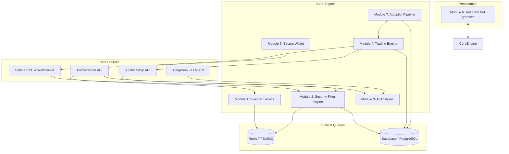

# 🚀 Solana Scalping Telegram Bot & Autopilot

[](file:///e:/Coding/solana-scalping/tests)
[](https://nodejs.org/)
[](https://www.typescriptlang.org/)
[](file:///e:/Coding/solana-scalping/docker-compose.yml)
[](LICENSE)

Bot Telegram *production-grade* untuk scalping dan auto-trading di jaringan Solana. Dibangun dengan standar keandalan tinggi, arsitektur modular, filter anti-rug multi-layer ketat, analisa AI scalping real-time (DeepSeek / OpenAI-compatible / Claude), enkripsi dompet tingkat bank (AES-256-GCM), routing Jupiter swap, antrean terdistribusi BullMQ, dan antarmuka Telegram interaktif yang mulus tanpa spam.

---

## 📑 Daftar Isi
1. [Fitur Utama](#-fitur-utama)
2. [Arsitektur Sistem](#-arsitektur-sistem)
3. [Daftar API & Layanan Eksternal](#-daftar-api--layanan-eksternal)
4. [Tech Stack](#-tech-stack)
5. [Struktur Direktori](#-struktur-direktori)
6. [Prasyarat Sistem](#-prasyarat-sistem)
7. [Panduan Instalasi & Setup](#-panduan-instalasi--setup)
8. [Panduan Menjalankan Bot](#-panduan-menjalankan-bot)
9. [Navigasi & Perintah Bot Telegram](#-navigasi--perintah-bot-telegram)
10. [Panduan Tombol Menu Interaktif](#-panduan-tombol-menu-interaktif)
11. [Pipeline Autopilot & Circuit Breaker](#-pipeline-autopilot--circuit-breaker)
12. [Sistem Keamanan & Kriptografi](#-sistem-keamanan--kriptografi)
13. [Pengujian (Testing)](#-pengujian-testing)
14. [Troubleshooting & FAQ](#-troubleshooting--faq)
15. [Disclaimer](#-disclaimer)

---

## 🌟 Fitur Utama

- **🛡️ Filter Anti-Rug & Honeypot Ketat (Multi-Layer)**:
  - Pemeriksaan status otoritas mint dan freeze *on-chain* (wajib di-revoke / dinonaktifkan).
  - Inspeksi mendalam ekstensi Token-2022 berbahaya (`transferFeeConfig`, `permanentDelegate`, `defaultAccountState`, dll.).
  - Simulasi eksekusi swap jual via Jupiter + RPC `simulateTransaction` untuk mendeteksi honeypot dan hidden tax secara akurat.
  - Analisis konsentrasi Top 10 Holder dan deteksi sniper wallet di blok peluncuran pool.
  - Perhitungan skor dinamis 0–100 dan aturan **Hard-Block** (otomatis tolak tanpa kompromi).

- **🧠 Analisa AI Scalping Real-time Tanpa Halusinasi**:
  - Perhitungan indikator programatik murni (EMA 9/21, RSI 14, ATR 14, Volume Spike Ratio).
  - Integrasi gateway LLM (*OpenAI-compatible* seperti DeepSeek v4 Flash atau Anthropic Claude) dengan schema output Zod JSON terstruktur.
  - Level TP/SL dihitung dinamis dari volatilitas pasar nyata (ATR-based).

- **💳 Dompet Solana Terenkripsi (AES-256-GCM)**:
  - Private key dienkripsi dengan master key 32-byte acak, IV 12-byte unik, dan auth tag 16-byte.
  - Alamat deposit instan monospace (tap-to-copy) lengkap dengan QR Code PNG.
  - Fitur ekspor Private Key mandiri dengan peringatan keamanan tingkat tinggi.
  - Deteksi saldo otomatis melalui RPC WebSocket.

- **⚡ Trading Engine Jupiter**:
  - Dynamic slippage berbasis likuiditas pool dan persentase *price impact* order.
  - Dynamic Priority Gas Fee otomatis berdasarkan persentil ke-75 transaksi on-chain (`getRecentPrioritizationFees`).
  - Mode default **Paper Trading (Dry-Run)** untuk simulasi transaksi nyata tanpa risiko kehilangan aset asli.
  - Mode **Live On-Chain Trading** yang dapat diaktifkan kapan saja melalui menu Pengaturan.

- **📱 UX Telegram Interaktif & Responsif**:
  - Dukungan lengkap tombol inline untuk navigasi cepat: Settings, Wallet, Autopilot, Positions, dan Scan.
  - **Auto-Detect Contract Address**: Pengguna cukup menempelkan alamat kontrak (CA) di chat tanpa perlu mengetik `/scan`.
  - Format pesan HTML elegan dengan progress bar visual (`▰▰▰▰▰▰▱▱▱▱ 60/100`) dan *in-place edit* untuk mencegah spam obrolan.

- **🤖 Pipeline Autopilot BullMQ & Redis**:
  - 4 antrean latar belakang: `scanQueue`, `evalQueue`, `execQueue`, dan `monitorQueue`.
  - Circuit Breaker proteksi modal (batas rugi harian & batas kekalahan beruntun).
  - Tabel audit `decision_logs` untuk mencatat setiap keputusan beli, lewati, atau tolak.

---

## 🏛️ Arsitektur Sistem



---

## 🔌 Daftar API & Layanan Eksternal

| Layanan | Fungsi | Endpoint / Metode | Keterangan & Batas |
|---|---|---|---|
| **Solana RPC** | Query on-chain, getBalance, simulasi tx, WebSocket | `https://api.mainnet-beta.solana.com` | Helius / QuickNode direkomendasikan untuk produksi |
| **DexScreener API** | Data candle, harga live, likuiditas, volume | `https://api.dexscreener.com/latest/dex/tokens` | Endpoint publik (~300 req/menit) |
| **Jupiter API** | Quote swap, routing rute terbaik, serialisasi swap | `@jup-ag/api` / `https://quote-api.jup.ag` | Bebas kuota publik, dynamic rate limit |
| **DeepSeek Gateway** | Evaluasi konfluensi setup scalping | `https://api.deepseek.com/v1/chat/completions` | Menggunakan model `deepseek-v4-flash` |
| **Supabase** | Database PostgreSQL relational untuk data user & log | `@supabase/supabase-js` | Tabel terstruktur dengan RLS dan foreign keys |
| **Redis 7** | Broker antrean BullMQ & distributed locks | `redis://127.0.0.1:6379` | Self-hosted via Docker container |

---

## 🛠️ Tech Stack

- **Runtime & Bahasa**: Node.js v22+ LTS (Native WebSocket support), TypeScript 5.7+
- **Telegram Bot Framework**: `grammy` v1.35+
- **Blockchain**: `@solana/web3.js`, `@solana/spl-token`, `@jup-ag/api`, `bs58`
- **Database**: Supabase (`@supabase/supabase-js` v2.49+)
- **Queue & Distributed Locks**: `bullmq`, `ioredis`
- **AI Engine**: OpenAI-compatible adapter (`deepseek-v4-flash`), `@anthropic-ai/sdk`
- **Keamanan & Kriptografi**: Node.js `crypto` (AES-256-GCM)
- **Validasi Data**: `zod`
- **Logging**: `pino`, `pino-pretty`
- **QR Code**: `qrcode`
- **Testing Framework**: `vitest` v3.2+
- **DevOps**: Docker, Docker Compose (Alpine Linux images)

---

## 📂 Struktur Direktori

```
solana-scalping/
├── .env.example                  # Template konfigurasi environment
├── Dockerfile                    # Multi-stage Dockerfile (Node 22 Alpine)
├── docker-compose.yml            # Konfigurasi container Docker (Bot + Redis)
├── package.json                  # Dependensi dan script npm
├── tsconfig.json                 # Konfigurasi compiler TypeScript
├── vitest.config.ts              # Konfigurasi pengujian Vitest
├── supabase/
│   └── migrations/
│       ├── 001_initial_schema.sql # DDL lengkap tabel Supabase (PostgreSQL)
│       └── 002_round2_fixes.sql   # Migrasi struktur lanjutan (Fase 2)
├── src/
│   ├── index.ts                  # Bootstrapper utama & graceful shutdown
│   ├── config/
│   │   └── env.ts                # Validasi schema Zod untuk environment variables
│   ├── database/
│   │   ├── client.ts             # Supabase singleton client
│   │   └── repositories/         # Repository pattern abstraksi database
│   │       ├── userRepository.ts
│   │       ├── walletRepository.ts
│   │       ├── tradeRepository.ts
│   │       └── autopilotRepository.ts
│   ├── queue/
│   │   ├── connection.ts         # Redis connection manager
│   │   └── queues.ts             # Definisi BullMQ queues typed
│   ├── modules/
│   │   ├── scanner/              # Modul 1: Token Scanner (DexScreener)
│   │   ├── security/             # Modul 2: Anti-Rug Security Filter Engine
│   │   ├── analyzer/             # Modul 3: AI Scalping Analyzer & Indikator
│   │   ├── trader/               # Modul 4: Trading Engine (Jupiter)
│   │   ├── wallet/               # Modul 5: Secure Wallet System (AES-256-GCM & bs58)
│   │   ├── telegram/             # Modul 6: Telegram Bot UI, Handlers & Routers
│   │   │   ├── handlers/         # Start, Wallet, Settings, Positions, Autopilot, Help
│   │   │   ├── formatters/       # Keyboard builder & Message formatters
│   │   │   └── router.ts         # Central callback query & command router
│   │   └── autopilot/            # Modul 7: Autopilot Engine & Circuit Breaker
│   └── utils/
│       └── logger.ts             # Structured logger Pino
└── tests/
    ├── integration/              # Integration test (Lifecycle & orchestration)
    └── unit/                     # Unit test (Security, Indicators, Sizing, Handlers, dll.)
```

---

## 📋 Prasyarat Sistem

Sebelum memulai instalasi, pastikan sistem Anda memiliki:
1. **Node.js**: Versi 22.x atau lebih baru (`node -v`).
2. **NPM**: Versi 10.x atau lebih baru (`npm -v`).
3. **Docker & Docker Compose**: Untuk menjalankan Redis dan kontainer aplikasi secara terisolasi.
4. **Proyek Supabase**: Akun Supabase gratis atau self-hosted PostgreSQL.
5. **Bot Telegram**: Token bot yang diperoleh dari [@BotFather](https://t.me/BotFather).

---

## ⚙️ Panduan Instalasi & Setup

### 1. Clone Repository
```bash
git clone https://github.com/kennedys0/potential-carnival.git
cd potential-carnival
```

### 2. Instalasi Dependensi
```bash
npm install
```

### 3. Konfigurasi Environment Variables
Salin file `.env.example` menjadi `.env`:
```bash
cp .env.example .env
```

Buka file `.env` dan lengkapi konfigurasi berikut:
```env
NODE_ENV=development

# Telegram Bot Token dari @BotFather
TELEGRAM_BOT_TOKEN=your_bot_token_here

# Solana RPC Endpoints
SOLANA_RPC_URL=https://api.mainnet-beta.solana.com
SOLANA_WSS_URL=wss://api.mainnet-beta.solana.com

# Kredensial Supabase
SUPABASE_URL=https://your-project.supabase.co
SUPABASE_SERVICE_ROLE_KEY=your_service_role_key_here

# Master Encryption Key (64 karakter hex = 32 bytes)
# Generate via terminal:
# node -e "console.log(require('crypto').randomBytes(32).toString('hex'))"
MASTER_ENCRYPTION_KEY=your_generated_64_hex_chars_key_here

# Konfigurasi Gateway AI (OpenAI-Compatible: DeepSeek)
AI_BASE_URL=
AI_API_KEY=
AI_MODEL=

# Redis Connection URL
REDIS_URL=redis://127.0.0.1:6379

# Security & Access Control
# Daftar ID Telegram pengguna yang diizinkan menggunakan bot (pisahkan dengan koma)
WHITELISTED_USERS=
# Daftar ID Telegram admin untuk akses kill-switch (pisahkan dengan koma)
ADMIN_USER_IDS=

# Trading Mode
# "false" = PAPER TRADING ONLY (Standar aman). "true" = LIVE ON-CHAIN TRADING (Risiko uang nyata)
LIVE_TRADING_ENABLED=false

```

### 4. Eksekusi Database Migration di Supabase
1. Masuk ke Dashboard Supabase Anda.
2. Buka menu **SQL Editor**.
3. Buka file [`supabase/migrations/001_initial_schema.sql`](file:///e:/Coding/solana-scalping/supabase/migrations/001_initial_schema.sql), salin isinya, dan jalankan (Run) di SQL Editor.
4. Ulangi langkah yang sama untuk file [`supabase/migrations/002_round2_fixes.sql`](file:///e:/Coding/solana-scalping/supabase/migrations/002_round2_fixes.sql).

---

## 🚀 Panduan Menjalankan Bot

### Opsi A: Menjalankan via Docker Compose (Rekomendasi Produksi)

Docker Compose akan menjalankan kontainer **Redis** dan **Solana Scalping Bot** dalam lingkungan terisolasi Node.js 22 Alpine:

```bash
# 1. Jalankan container di background dengan auto-build
docker compose up -d --build

# 2. Pantau log jalannya bot secara real-time
docker compose logs -f bot
```

Untuk menghentikan kontainer:
```bash
docker compose down
```

### Opsi B: Menjalankan Lokal (Development)

1. Jalankan Redis lokal via Docker:
   ```bash
   docker run -d --name local-redis -p 6379:6379 redis:7-alpine
   ```
2. Jalankan bot dalam mode watch:
   ```bash
   npm run dev
   ```

---

## 📱 Navigasi & Perintah Bot Telegram

Bot mendukung perintah teks standar maupun interaksi tombol penuh:

| Perintah | Deskripsi |
|---|---|
| `/start` | Mendaftarkan akun pengguna, menginisialisasi wallet Solana terenkripsi, dan menampilkan Menu Utama. |
| `/wallet` | Membuka dashboard wallet: alamat deposit monospace, QR Code, dan tombol aksi saldo. |
| `/scan <CA>` | Memindai token Solana secara manual dengan analisis anti-rug dan verdict AI. |
| `[Kirim Alamat CA]` | **Auto-detect**: Cukup paste alamat kontrak token (32–44 karakter base58) langsung di chat. |
| `/autopilot` | Membuka panel kontrol Autopilot: status aktif, preset risiko, log keputusan, dan statistik. |
| `/settings` | Membuka konfigurasi bot: toggle Paper/Live, trade size, dan profil risiko. |
| `/positions` | Memantau daftar posisi trading aktif, harga entry, alokasi SOL, dan estimasi token. |
| `/help` | Menampilkan panduan komprehensif, fitur keamanan, dan daftar perintah. |
| `/set_withdraw_address <CA>` | Mendaftarkan alamat Solana (Wallet Utama) untuk mencairkan dana secara eksklusif. |
| `/withdraw` | Membuka panduan / mengeksekusi penarikan dana hanya ke alamat yang telah didaftarkan. |

---

## 🎛️ Panduan Tombol Menu Interaktif

Semua tombol di antarmuka Telegram telah terhubung secara interaktif:

### 🏠 Menu Utama
- **🔍 Scan Token**: Petunjuk pengiriman alamat kontrak token untuk dianalisis.
- **💳 Wallet & Deposit**: Membuka dashboard saldo dan QR code dompet Anda.
- **🤖 Autopilot**: Kontrol bot trading otomatis.
- **📊 Positions**: Menampilkan posisi trading terbuka.
- **⚙️ Settings**: Pengaturan mode (Paper/Live) dan parameter transaksi.
- **❓ Bantuan**: Panduan penggunaan bot dan fitur keamanan.

### ⚙️ Menu Settings
- **⚡ Beralih ke LIVE / 🟢 Beralih ke PAPER**: Toggle instan antara mode simulasi dan mode live on-chain.
- **🛡️ Konservatif / ⚖️ Moderat / ⚡ Agresif**: Penggantian preset risiko instan.
- **💰 Size: 0.05 SOL / 0.1 SOL / 0.25 SOL**: Mengubah alokasi trading per order.
- **🏠 Menu Utama**: Kembali ke navigasi awal.

### 💳 Menu Wallet
- **🔄 Refresh Saldo**: Melakukan query RPC on-chain terbaru dan memperbarui tampilan pesan.
- **💸 Withdraw**: Menampilkan instruksi penarikan dana ke dompet eksternal.
- **🔑 Export Private Key**: Menampilkan Base58 Private Key Anda secara aman dengan peringatan proteksi.
- **🏠 Menu Utama**: Kembali ke navigasi awal.

### 🤖 Menu Autopilot
- **▶️ Aktifkan Autopilot / ⏸ Jeda Autopilot**: Toggle status eksekusi otomatis.
- **Preset Risiko**: Pilihan profil Konservatif, Moderat, atau Agresif.
- **📜 Log Keputusan**: Menampilkan 5 riwayat analisis terakhir (BUY, SKIP, REJECT).
- **📊 Statistik**: Menampilkan metrik win rate, total trades, dan status Circuit Breaker.

---

## 🛡️ Pipeline Autopilot & Circuit Breaker

### Alur Eksekusi:
```
Scanner ➔ Anti-Rug Security Filter ➔ AI Scalping Analyzer ➔ Autopilot Rule Check ➔ Risk Manager ➔ Trading Engine ➔ Position Monitor
```

1. **Anti-Rug Filter**:
   - Jika token terdeteksi honeypot, mint authority aktif, atau ekstensi Token-2022 berbahaya, token langsung di-**REJECT** (skor 0).
2. **AI Verdict**:
   - Autopilot hanya mengeksekusi order jika AI memberikan verdict `BUY` dengan *confidence score* di atas ambang batas preset pengguna.
3. **Circuit Breaker**:
   - Jika akumulasi kerugian harian (`daily_realized_pnl`) melampaui `maxDailyLossSol`, Autopilot otomatis **JEDA (PAUSE)** seketika.
   - Jika terjadi kekalahan beruntun (`maxConsecutiveLosses`), sistem otomatis menghentikan eksekusi untuk melindungi sisa modal.
4. **Audit Logging**:
   - Setiap token yang dipindai (baik dieksekusi maupun ditolak) dicatat lengkap di tabel `decision_logs` untuk keperluan evaluasi dan audit transparansi.

---

## 🔒 Sistem Keamanan & Kriptografi

Keamanan private key pengguna adalah prioritas tertinggi sistem:
1. **Enkripsi AES-256-GCM**:
   - Kunci privat dienkripsi menggunakan Node.js `crypto` bawaan.
   - Menggunakan Initialization Vector (IV) 12-byte unik per enkripsi dan Authentication Tag 16-byte untuk menjamin integritas data (anti-tamper).
2. **Isolasi Master Key**:
   - `MASTER_ENCRYPTION_KEY` hanya disimpan dalam variabel lingkungan (`.env`) dan tidak pernah disimpan di database atau diekspos ke klien.
3. **Default Paper Trading**:
   - Seluruh akun baru secara default berada dalam mode **Paper Trading (Simulasi)**. Modal asli Anda tidak akan tersentuh sampai Anda secara sengaja beralih ke mode Live di menu Pengaturan.

---

## 🧪 Pengujian (Testing)

Proyek ini dibangun menggunakan metodologi **Test-Driven Development (TDD)**:

Jalankan seluruh test suite:
```bash
npm test
```

Hasil pengujian saat ini (Vitest):
```text
 Test Files  21 passed (21)
      Tests  51 passed (51)
```

Verifikasi type-safety TypeScript:
```bash
npx tsc --noEmit
```

---

## ❓ Troubleshooting & FAQ

### 1. Error: `Node.js detected but native WebSocket not found`
- **Penyebab**: Versi `@supabase/supabase-js` v2.49+ membutuhkan Node.js 22+ yang memiliki native `WebSocket`.
- **Solusi**: Pastikan Anda menggunakan Node.js 22+ atau jalankan via Docker Compose yang sudah dikonfigurasi dengan `node:22-alpine`.

### 2. Tombol di Telegram tidak merespons
- **Penyebab**: Bot container mungkin belum diperbarui ke versi router terbaru.
- **Solusi**: Jalankan perintah `docker compose up -d --build bot` untuk menerapkan routing interaktif terbaru.

### 3. Gagal koneksi Redis
- **Solusi**: Pastikan container Redis sedang berjalan (`docker compose ps`). Jika menjalankan lokal tanpa docker compose, jalankan `docker run -d -p 6379:6379 redis:7-alpine`.

---

## ⚠️ Disclaimer

Aplikasi ini ditujukan untuk keperluan quantitative trading, riset pasar, dan edukasi. Perdagangan aset kripto di jaringan Solana memiliki tingkat volatilitas dan risiko kerugian modal yang tinggi. Pengembang dan kontributor tidak bertanggung jawab atas kerugian finansial yang diakibatkan oleh keputusan trading atau penggunaan bot ini. **Do Your Own Research (DYOR)**.
