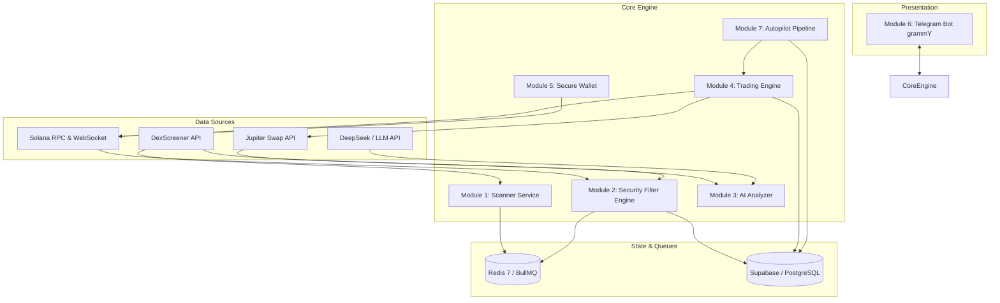

# 🚀 Solana Scalping Telegram Bot & Autopilot

Bot Telegram production-grade untuk scalping dan auto-trading di jaringan Solana. Dilengkapi dengan filter anti-rug ketat, analisa AI multi-timeframe real-time (DeepSeek / Claude), sistem dompet terenkripsi AES-256-GCM, engine eksekusi swap Jupiter, antrean terdistribusi BullMQ, dan antarmuka Telegram interaktif tanpa spam.

---

## 📑 Daftar Isi
1. [Fitur Utama](#-fitur-utama)
2. [Arsitektur Sistem](#-arsitektur-sistem)
3. [Daftar API & Layanan Eksternal](#-daftar-api--layanan-eksternal)
4. [Tech Stack](#-tech-stack)
5. [Struktur Direktori](#-struktur-direktori)
6. [Prasyarat Sistem](#-prasyarat-sistem)
7. [Panduan Instalasi & Setup](#-panduan-instalasi--setup)
8. [Panduan Menjalankan Bot](#-panduan-menjalankan-bot)
9. [Navigasi & Perintah Bot](#-navigasi--perintah-bot)
10. [Pipeline Autopilot & Circuit Breaker](#-pipeline-autopilot--circuit-breaker)
11. [Pengujian (Testing)](#-pengujian-testing)
12. [Disclaimer](#-disclaimer)

---

## 🌟 Fitur Utama

- **🛡️ Filter Anti-Rug & Honeypot Ketat**:
  - Pemeriksaan status otoritas mint dan freeze on-chain (wajib revoked).
  - Inspeksi ekstensi berbahaya Token-2022 (`transferFeeConfig`, `permanentDelegate`, dll.).
  - Simulasi eksekusi jual via Jupiter + RPC `simulateTransaction` untuk mendeteksi honeypot dan hidden tax.
  - Analisis konsentrasi Top 10 Holder dan deteksi wallet sniper di blok peluncuran pool.
  - Perhitungan skor dinamis 0–100 dan aturan **Hard-Block** (otomatis REJECT).
- **🤖 Analisa AI Real-time Tanpa Halusinasi**:
  - Perhitungan indikator programatik murni (EMA 9/21, RSI 14, ATR 14, Volume Spike Ratio).
  - Integrasi LLM gateway (DeepSeek v4 Flash / OpenAI-compatible / Anthropic Claude) dengan schema output Zod JSON terstruktur.
  - Level TP/SL dihitung dinamis dari volatilitas pasar nyata (ATR-based).
- **💳 Dompet Solana Terenkripsi (AES-256-GCM)**:
  - Private key dienkripsi dengan master key 32-byte (IV 12-byte & auth tag 16-byte).
  - Deposit instan dengan alamat monospace dan gambar QR Code PNG.
  - Deteksi saldo otomatis via WebSocket RPC.
- **⚡ Trading Engine Jupiter**:
  - Slippage dinamis berbasis likuiditas dan price impact order.
  - Dynamic Priority Fee dari persentil ke-75 on-chain (`getRecentPrioritizationFees`).
  - Mode default **Paper Trading (Dry-Run)** untuk simulasi aman dengan data pasar nyata.
- **📱 UX Telegram Bersih & Interaktif**:
  - Menggunakan format HTML rapi dengan progress bar skor teks (`▰▰▰▰▰▰▱▱▱▱ 60/100`).
  - Pembaruan pesan di tempat (*in-place edit*) untuk mencegah spam chat.
- **🤖 Pipeline Autopilot BullMQ**:
  - 4 antrean latar belakang: `scanQueue`, `evalQueue`, `execQueue`, `monitorQueue`.
  - Circuit Breaker proteksi akun (batas rugi harian & batas kekalahan beruntun).
  - Tabel audit `decision_logs` untuk mencatat setiap keputusan beli atau tolak.

---

## 🏛️ Arsitektur Sistem



---

## 🔌 Daftar API & Layanan Eksternal

| Layanan | Fungsi | Endpoint / Metode | Rate Limits / Catatan |
|---|---|---|---|
| **Solana RPC** | Query on-chain, getBalance, simulasi tx, WebSocket | `https://api.mainnet-beta.solana.com` | Tergantung penyedia (Helius/QuickNode disarankan untuk produksi) |
| **DexScreener API** | Data candle, harga, likuiditas, volume | `https://api.dexscreener.com/latest/dex/tokens` | Publik (~300 req/min) |
| **Jupiter API** | Quote swap, routing rute terbaik, serialisasi swap | `@jup-ag/api` / `https://quote-api.jup.ag` | Bebas kuota publik, dynamic rate limit |
| **DeepSeek Gateway** | Evaluasi konfluensi setup scalping | `https://bandelbanget.xyz/v1/chat/completions` | Membutuhkan API Key valid |
| **Supabase** | Database PostgreSQL relational untuk data user & log | `@supabase/supabase-js` | Sesuai tier project Supabase |
| **Redis 7** | Broker antrean BullMQ & distributed locks | `redis://127.0.0.1:6379` | Self-hosted via Docker |

---

## 🛠️ Tech Stack

- **Runtime & Bahasa**: Node.js v22+ LTS, TypeScript 5.7+
- **Telegram Bot Framework**: `grammy` v1.35+
- **Blockchain**: `@solana/web3.js`, `@solana/spl-token`, `@jup-ag/api`
- **Database**: Supabase (`@supabase/supabase-js`)
- **Queue & Distributed Locks**: `bullmq`, `ioredis`
- **AI Engine**: OpenAI-compatible adapter (`deepseek-v4-flash`), `@anthropic-ai/sdk`
- **Keamanan & Kriptografi**: Node.js `crypto` (AES-256-GCM)
- **Validasi Data**: `zod`
- **Logging**: `pino`, `pino-pretty`
- **QR Code**: `qrcode`
- **Testing Framework**: `vitest`
- **DevOps**: Docker, Docker Compose

---

## 📂 Struktur Direktori

```
solana-scalping/
├── .env.example                  # Template konfigurasi environment
├── docker-compose.yml            # Konfigurasi container Docker (Bot + Redis)
├── package.json                  # Dependensi dan script npm
├── tsconfig.json                 # Konfigurasi compiler TypeScript
├── vitest.config.ts              # Konfigurasi unit/integration test Vitest
├── supabase/
│   └── migrations/
│       └── 001_initial_schema.sql # DDL lengkap tabel Supabase (PostgreSQL)
├── src/
│   ├── index.ts                  # Bootstrapper utama & graceful shutdown
│   ├── config/
│   │   └── env.ts                # Validasi schema Zod untuk environment variables
│   ├── database/
│   │   ├── client.ts             # Supabase singleton client
│   │   └── repositories/         # Repository pattern untuk abstraksi database
│   │       ├── userRepository.ts
│   │       ├── walletRepository.ts
│   │       ├── tradeRepository.ts
│   │       └── autopilotRepository.ts
│   ├── queue/
│   │   ├── connection.ts         # Redis connection manager
│   │   └── queues.ts             # Definisi BullMQ queues typed
│   ├── modules/
│   │   ├── scanner/              # Modul 1: Token Scanner
│   │   ├── security/             # Modul 2: Anti-Rug Security Filter
│   │   ├── analyzer/             # Modul 3: AI Scalping Analyzer & Indikator
│   │   ├── trader/               # Modul 4: Trading Engine (Jupiter)
│   │   ├── wallet/               # Modul 5: Secure Wallet System (AES-256-GCM)
│   │   ├── telegram/             # Modul 6: Telegram Bot UI & Formatters
│   │   └── autopilot/            # Modul 7: Autopilot Engine & Circuit Breaker
│   └── utils/
│       └── logger.ts             # Structured logger Pino
└── tests/
    ├── integration/              # Integration test (Lifecycle)
    └── unit/                     # Unit test (Security, Indicators, Sizing, dll.)
```

---

## 📋 Prasyarat Sistem

Sebelum memulai instalasi, pastikan sistem Anda memiliki:
1. **Node.js**: Versi 22.x atau lebih baru (`node -v`).
2. **NPM**: Versi 10.x atau lebih baru (`npm -v`).
3. **Docker & Docker Compose**: Untuk menjalankan Redis dan kontainer aplikasi secara terisolasi.
4. **Proyek Supabase**: Akun Supabase gratis atau self-hosted PostgreSQL.
5. **Bot Telegram**: Token bot yang diperoleh dari [@BotFather](https://t.me/BotFather).

---

## ⚙️ Panduan Instalasi & Setup

### 1. Clone Repository
```bash
git clone https://github.com/kennedys0/potential-carnival.git
cd potential-carnival
```

### 2. Instalasi Dependensi
```bash
npm install
```

### 3. Konfigurasi Environment Variables
Salin file `.env.example` menjadi `.env`:
```bash
cp .env.example .env
```

Buka file `.env` dan sesuaikan nilainya:
```env
NODE_ENV=development

# Telegram Bot Token dari @BotFather
TELEGRAM_BOT_TOKEN=your_bot_token_here

# Solana RPC Endpoints
SOLANA_RPC_URL=https://api.mainnet-beta.solana.com
SOLANA_WSS_URL=wss://api.mainnet-beta.solana.com

# Kredensial Supabase
SUPABASE_URL=https://your-project.supabase.co
SUPABASE_SERVICE_ROLE_KEY=your_service_role_key_here

# Master Encryption Key (64 hex characters = 32 bytes)
# Generate via terminal: node -e "console.log(require('crypto').randomBytes(32).toString('hex'))"
MASTER_ENCRYPTION_KEY=your_generated_64_hex_chars_key_here

# Konfigurasi Gateway AI (OpenAI-Compatible: DeepSeek / Qwen)
AI_BASE_URL=https://baseurl.xyz/v1
AI_API_KEY=your_ai_api_key_here
AI_MODEL=gpt-4o-mini

# Redis Connection URL
REDIS_URL=redis://127.0.0.1:6379
```

### 4. Setup Database Supabase
1. Masuk ke Dashboard Supabase Anda.
2. Buka menu **SQL Editor**.
3. Buka file [`supabase/migrations/001_initial_schema.sql`](file:///e:/Coding/solana-scalping/supabase/migrations/001_initial_schema.sql), salin seluruh isinya, dan tempelkan ke SQL Editor Supabase.
4. Klik **Run** untuk membuat semua tabel, enum, dan index yang diperlukan.

---

## 🚀 Panduan Menjalankan Bot

### Opsi A: Menjalankan Lokal (Development)

1. Jalankan layanan Redis terlebih dahulu via Docker:
   ```bash
   docker run -d --name local-redis -p 6379:6379 redis:7-alpine
   ```
2. Jalankan bot dalam mode watch:
   ```bash
   npm run dev
   ```

### Opsi B: Menjalankan via Docker Compose (Produksi)

Jalankan seluruh stack (Bot + Redis) di background:
```bash
docker-compose up -d --build
```

Melihat log aplikasi secara langsung:
```bash
docker-compose logs -f bot
```

---

## 📱 Navigasi & Perintah Bot

| Perintah | Deskripsi |
|---|---|
| `/start` | Mendaftarkan user baru, membuat wallet Solana terenkripsi, dan membuka Menu Utama. |
| `/wallet` | Membuka manajemen dompet: alamat deposit monospace, QR Code, dan saldo SOL real-time. |
| `/scan <CA>` | Melakukan pemindaian instan untuk token berdasarkan Contract Address (CA). |
| `/autopilot` | Membuka dashboard Autopilot: status aktif, mode (Paper/Live), preset risiko, dan statistik. |

### Tampilan Laporan Token (`/scan`):
Pesan laporan token diformat dalam HTML yang elegan dan informatif:
- Informasi dasar: Nama, Simbol, Contract Address (tap-to-copy).
- Metrik pasar: Harga live, perubahan 5m/1h, Likuiditas USD, Volume 5m.
- **Safety Score**: Skor 0–100 dengan progress bar teks visual dan rincian bendera risiko.
- **Analisa AI Scalping**: Verdict (BUY/WAIT/AVOID), level Stop Loss dan Take Profit berbasis ATR, serta konfluensi setup.
- Tombol aksi inline keyboard: `[💰 Buy 0.1]` `[💰 Buy 0.5]` `[🔄 Refresh]` `[📊 DexScreener]` `[🔍 Solscan]`.

---

## 🛡️ Pipeline Autopilot & Circuit Breaker

### Alur Eksekusi:
```
Scanner ➔ Anti-Rug Security Filter ➔ AI Scalping Analyzer ➔ Autopilot Rule Check ➔ Risk Manager ➔ Trading Engine ➔ Position Monitor
```

1. **Anti-Rug Filter**: Jika token terdeteksi honeypot, mint authority aktif, atau ekstensi Token-2022 berbahaya, token langsung di-**REJECT** (skor 0).
2. **AI Verdict**: Autopilot hanya melanjutkan jika AI memberikan verdict `BUY` dengan confidence di atas ambang batas user.
3. **Circuit Breaker**:
   - Jika kerugian harian (`daily_realized_pnl`) melampaui `maxDailyLossSol`, Autopilot otomatis **JEDA (PAUSE)** seketika.
   - Jika terjadi kekalahan beruntun (`maxConsecutiveLosses`), sistem otomatis menjeda diri untuk melindungi modal.
4. **Audit Logging**: Setiap token yang diproses (baik diterima maupun ditolak) dicatat lengkap di tabel `decision_logs` untuk evaluasi dan backtest.

---

## 🧪 Pengujian (Testing)

Proyek ini dibangun menggunakan metodologi **Test-Driven Development (TDD)** dengan cakupan pengujian komprehensif menggunakan Vitest:

Jalankan seluruh pengujian:
```bash
npm test
```

Verifikasi type-safety TypeScript:
```bash
npx tsc --noEmit
```

---

## ⚠️ Disclaimer

Aplikasi ini ditujukan untuk keperluan quantitative trading dan edukasi. Perdagangan aset kripto di jaringan Solana memiliki tingkat volatilitas dan risiko kerugian yang tinggi. Penulis dan kontributor tidak bertanggung jawab atas kerugian finansial yang diakibatkan oleh penggunaan bot ini. **Do Your Own Research (DYOR)**.
